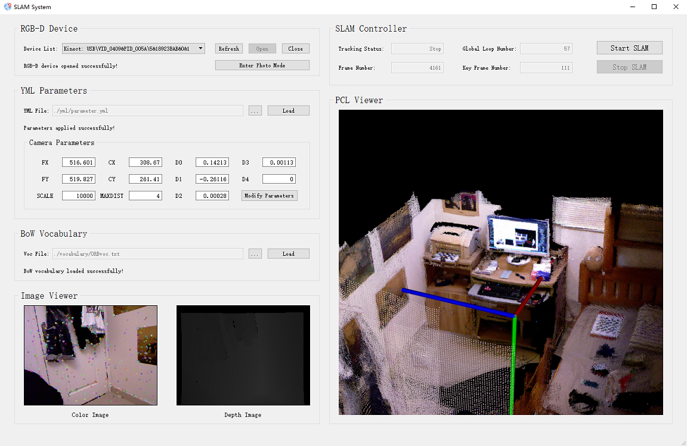
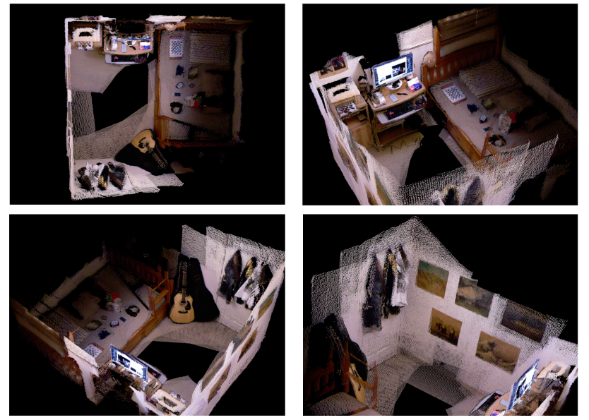

# **SLAM**

本SLAM（Simultaneous Localization and Mapping）主要基于特征点方法，利用Kinect V1设备实现了室内小场景的三位重建。代码中部分借鉴了[ORB_SLAM2](https://github.com/raulmur/ORB_SLAM2.git)，感谢[raulmur](<https://github.com/raulmur>)开源了如此成熟的SLAM方案。下面是GUI（Qt进行设计与编写）下三维重建的效果。

## 1. Result

三维重建最终效果如下：

## 2. Requirements

#### Hardware:

- Kinect V1
- A powerful PC

#### Operation System:

- Windows 10

#### Libraries:

- [Qt](https://www.qt.io/) 5.9.6
- [Kinect SDK](https://developer.microsoft.com/en-us/windows/kinect) 1.8
- [g2o](https://github.com/RainerKuemmerle/g2o) (commit: 4bcabdf)
- [OpenCV](https://github.com/opencv/opencv) 2.4.13.2
- [PCL](https://github.com/PointCloudLibrary/pcl) 1.8.0
- [VTK](https://github.com/Kitware/VTK) 7.0
- [libQGLViewer](https://github.com/GillesDebunne/libQGLViewer) 2.6.4

## 3. Build

首先，将 **slam/3rd_part/g2o_addons** 覆盖到自己从仓库拉下来的 **g2o**，并对其再一次编译安装。完成后用 **Visual Studio** 打开 **slam.sln** 编译即可。

## 4. Run

将Kinect插入电脑并打开slam程序后，可以看到完整的GUI。

- RGB-D Device：识别并开启Kinect设备
- YML Parameters：从YML中读取相机内外参数（也可手动修改）
- BoW Vocabulary：读取BoW词典，用于检测回环
- Image Viewer：显示彩色图和深度图
- SLAM Controller：启动/停止三维重建，并显示相关状态信息
- PCL Viewer：显示三维重建后的点云图